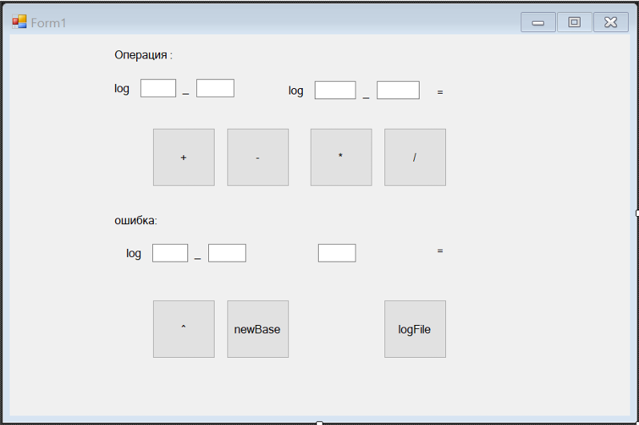
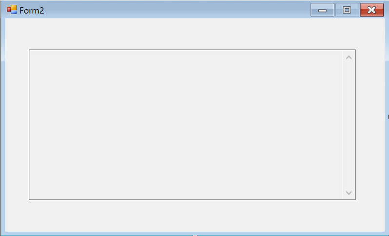
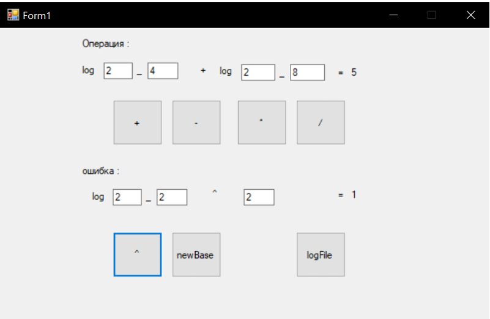
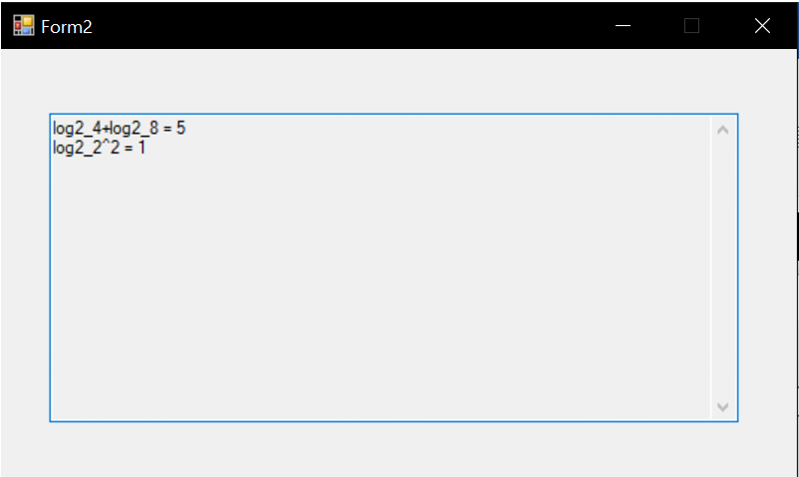

# Калькулятор Логарифмов

## Постановка задачи:  

Разработать программу-калькулятор для выполнения операций над 
логарифмами чисел. 

### Программа должна обеспечивать: 

• Ввод числа и основания логарифма с проверкой корректности (число > 
0, основание > 0, основание ≠ 1). 

• Выполнение операций: сложение, вычитание, умножение на число, 
деление на число, возведение в степень, переход к другому основанию. 

• Ведение протокола работы в файле (исходные данные, операции, 
результаты, ошибки). 

• Просмотр протокола из программы. 

• Обработку ошибок с выводом сообщений. 

• Графический интерфейс для ввода данных и выбора операций.

## Описание пользовательских классов: 

### Название класса: Logarithm 
Назначение: представляет логарифм с заданными основанием и аргументом, 
обеспечивает проверку корректности входных данных и предоставляет 
перегруженные арифметические операции для работы с логарифмами. 

### Компонентные данные: 

Base – double - Основание логарифма. Должно быть больше 0 и не равно 1. 

Argument – double - Аргумент логарифма. Должен быть больше 0. 

### Компонентные методы и их назначение: 

• Logarithm(double logBase, double logArg) - Создает объект логарифма. 
Выполняет проверку корректности основания и аргумента. При 
недопустимых значениях выбрасывает исключение ArgumentException. 
В случае успешной инициализации выводит в консоль созданный 
логарифм. 

• ToString() - Возвращает строковое представление логарифма в 
формате log{Base}_{Argument} для удобного вывода. 

• operator +(Logarithm a, Logarithm b) - Перегруженный оператор 
сложения. Вычисляет численные значения двух логарифмов с 
помощью метода Math.Log() и возвращает их сумму. 

• operator -(Logarithm a, Logarithm b) - Перегруженный оператор 
вычитания. Вычисляет численные значения двух логарифмов и 
возвращает их разность. 

• operator *(Logarithm a, Logarithm b) - Перегруженный оператор 
умножения. Вычисляет численные значения двух логарифмов и 
возвращает их произведение. 

• operator /(Logarithm a, Logarithm b) - Перегруженный оператор деления. 
Вычисляет численные значения двух логарифмов и возвращает их 
частное. 


```charp
public class Logarithm 
{ 
    public double Base { get; set; } 

    public double Argument { get; set; }
    
    // Создаёт объект логарифма с указанным основанием и аргументом. 
    // logBase - целочисленное основание логарифма; должно быть больше нуля и не равно единице. 
    // logArg - целочисленный аргумент логарифма; должен быть больше нуля.  
    public Logarithm(double logBase, double logArg) 
    { 
        if (logBase != 1 && logBase <= 0) 
        { 
            throw new ArgumentException("База логарифма должна быть больше 0 и не равна 1"); 
        } 
        else if (logArg <= 0) 
        { 
            throw new ArgumentException("Аргумент логарифма должна быть больше 0 "); 
        } 

        Base = logBase; 
        Argument = logArg; 
        Console.WriteLine($"log{Base}_{Argument}"); 
    } 

// Возвращает строковое представление логарифма в удобном для вывода формате. 
public override string ToString() 
{ 
    return $"log{Base}_{Argument}"; 
} 

// Складывает численные значения двух логарифмов - !перегруженная операция! 
public static double operator +(Logarithm a, Logarithm b) 
{ 
    double firstlog = Math.Log(a.Argument, a.Base); 
    double secondlog = Math.Log(b.Argument, b.Base); 
    double result = firstlog + secondlog; 
            return result; 
 } 
 
    // Вычитает численное значение второго логарифма из численного значения первого - !перегруженная 
операция! 
    public static double operator -(Logarithm a, Logarithm b) 
    { 
        double firstlog = Math.Log(a.Argument, a.Base); 
        double secondlog = Math.Log(b.Argument, b.Base); 
 
        double result = firstlog - secondlog; 
 
        return result; 
    } 
 
    // Умножает численные значения двух логарифмов - !перегруженная операция! 
    public static double operator *(Logarithm a, Logarithm b) 
    { 
        double firstlog = Math.Log(a.Argument, a.Base); 
        double secondlog = Math.Log(b.Argument, b.Base); 
 
        double result = firstlog * secondlog; 
 
        return result; 
    } 
 
    // Делит численное значение первого логарифма на численное значение второго - !перегруженная 
операция! 
    public static double operator /(Logarithm a, Logarithm b) 
    { 
        double firstlog = Math.Log(a.Argument, a.Base); 
        double secondlog = Math.Log(b.Argument, b.Base); 
 
        double result = firstlog / secondlog; 
 
        return result; 
    } 
 
} 
    public double Power(Logarithm a, double exponent) 
    { 
        double firstlog = Math.Log(a.Argument, a.Base); 
        double result = Math.Pow(firstlog, exponent); 
 
 
        return result; 
    } 
 
    // Выполняет переход к другому основанию и возвращает численное значение логарифма в новом 
основании. 
    public double ChangeBaseValue(Logarithm a, double newBase) 
    { 
        double firstlog = Math.Log(a.Argument, a.Base); 
        double result = Math.Log(firstlog, newBase); 
 
 
        return result; 
    } 
```
### Название класса: LogCalculator
Назначение: предоставляет дополнительные математические операции для 
работы с логарифмами, включая возведение в степень и смену основания 
логарифма. 

### Компонентные данные: 
Класс не содержит полей или свойств, так как 
предназначен только для выполнения операций над переданными объектами. 

### Компонентные методы и их назначение: 
• Power(Logarithm a, double exponent) - Принимает объект логарифма и 
показатель степени. Вычисляет численное значение логарифма с 
помощью Math.Log(), затем возводит полученное значение в 
указанную степень с помощью Math.Pow(). Возвращает результат 
возведения в степень. 

• ChangeBaseValue(Logarithm a, double newBase) - Принимает объект 
логарифма и новое основание. Вычисляет численное значение 
исходного логарифма, затем переводит его в логарифм с новым 
основанием с помощью Math.Log(). Возвращает численное значение 
логарифма в новом основании. 


```charp
    public class LogCalculator 
    { 
        // Возводит численное значение логарифма в указанную степень. 
        public double Power(Logarithm a, double exponent) 
        { 
            double firstlog = Math.Log(a.Argument, a.Base); 
            double result = Math.Pow(firstlog, exponent); 

            return result; 
        } 

    // Выполняет переход к другому основанию и возвращает численное значение логарифма в новом 
    основании. 

         public double ChangeBaseValue(Logarithm a, double newBase) 
        { 
        double firstlog = Math.Log(a.Argument, a.Base); 
        double result = Math.Log(firstlog, newBase); 

        return result; 
        } 
    }
```
## Примеры экранных форм или диалогов, используемые для взаимодействия с пользователем




## Примеры результатов работы программы (скриншоты)




## Программная документация 

### Названия файлов, из которых состоит проект: 
• Form1.cs - Главная форма приложения. Содержит логику графического 
интерфейса, обработчики событий кнопок, методы ввода данных и 
ведения протокола. 
• Form1.Designer.cs - Файл автоматически генерируемого кода, 
содержащий описание визуальных компонентов главной формы. 
• Form2.cs - Вспомогательная форма для просмотра протокола работы 
калькулятора. 
• Form2.Designer.cs - Файл автоматически генерируемого кода, 
содержащий описание визуальных компонентов формы просмотра 
протокола. 
• Program.cs - Главный файл точки входа в приложение, запускающий 
главную форму. 
• calculator.log - Текстовый файл, создаваемый программой 
автоматически, в котором ведется протокол всех операций, результатов 
и ошибок. 

### Названия библиотек, необходимых для выполнения проекта: 
• System - Предоставляет базовые классы, включая математические 
функции (Math.Log, Math.Pow) и обработку исключений. 
• System.IO - Обеспечивает работу с файлами: запись и чтение 
протокола (File.WriteAllText, File.AppendAllText, File.ReadAllText). 
• System.Windows.Forms - Предоставляет классы для создания 
графического интерфейса: формы, кнопки, текстовые поля, 
обработчики событий. 

### Инструкция пользователю для работы с проектом 
#### Запуск программы: 
1. Запустите исполняемый файл Calculator_app.exe. 
2. Откроется главное окно калькулятора. 
Ввод данных: 
• Для операций с двумя логарифмами (сложение, вычитание, умножение, 
деление) заполните поля: 
o Основание 1 и Аргумент 1 — для первого логарифма. 
o Основание 2 и Аргумент 2 — для второго логарифма. 
• Для операций с одним логарифмом (возведение в степень, смена 
основания) заполните поля: 
o Основание и Аргумент — для логарифма. 
o Значение — показатель степени или новое основание. 

#### Правила ввода: 
• Основание логарифма должно быть больше 0 и не равно 1. 
• Аргумент логарифма должен быть больше 0. 
• Допускается ввод целых и дробных чисел (разделитель — точка). 

#### Выполнение операций: 
• Нажмите соответствующую кнопку: 
o + — сложение двух логарифмов. 
o – — вычитание логарифмов. 
o × — умножение логарифмов. 
o ÷ — деление логарифмов. 
o ^ — возведение логарифма в степень. 
o nb — переход к новому основанию. 

• Результат операции отобразится в поле Результат. 
• При ошибке ввода в поле ошибка появится сообщение с пояснением. 
Просмотр протокола: 
• Нажмите кнопку logFile для открытия окна с историей всех 
выполненных операций. 
• В протоколе фиксируются: исходные данные, выполненные операции, 
полученные результаты и сообщения об ошибках. 
Завершение работы: 
• Закройте окно программы стандартным способом (крестик в правом 
верхнем углу).

